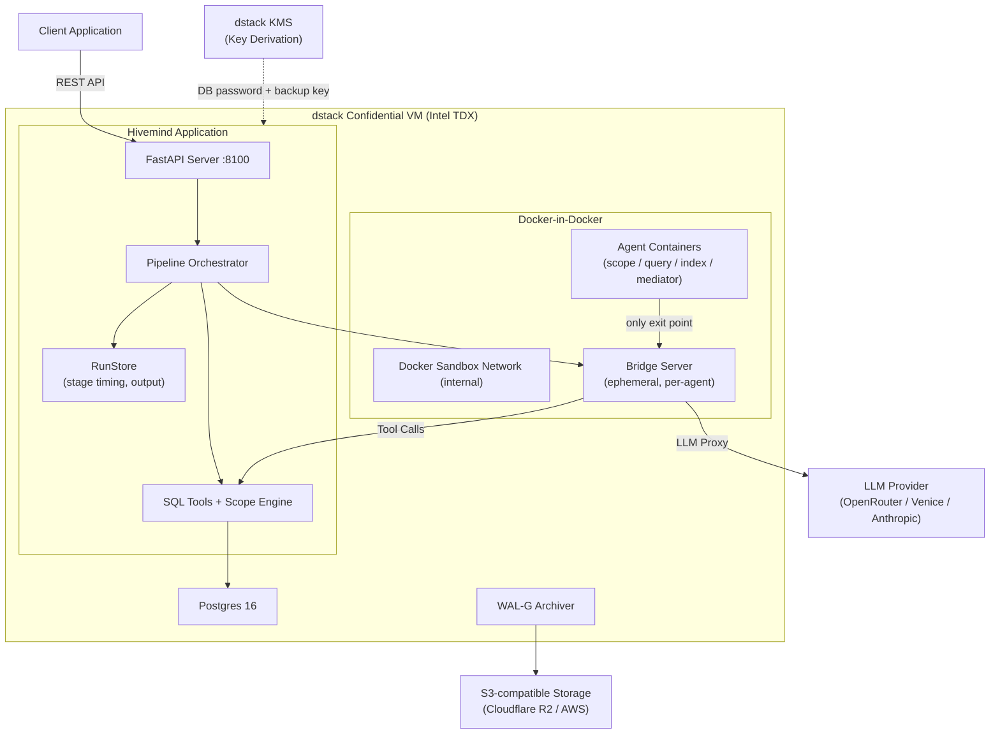
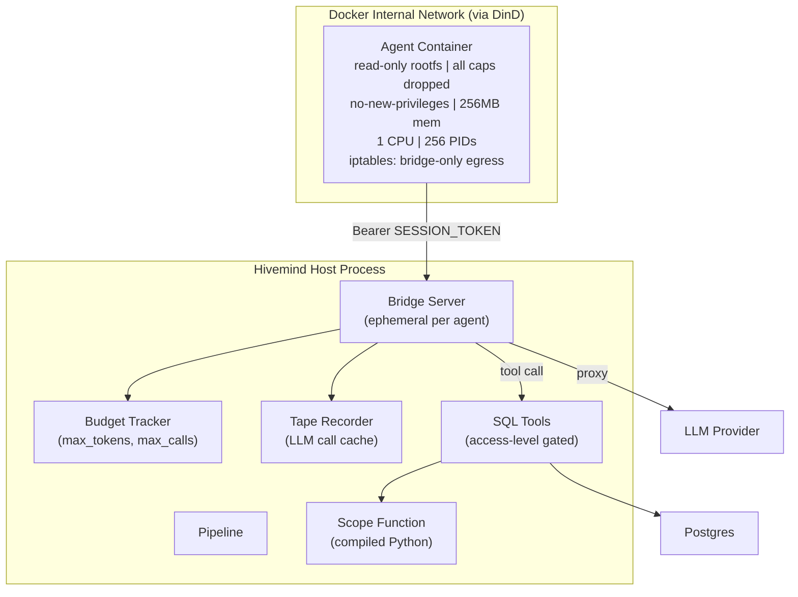
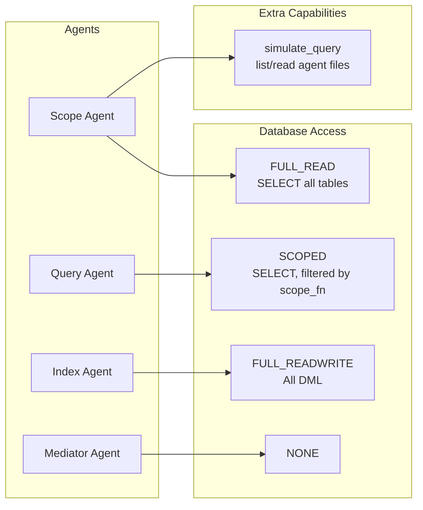
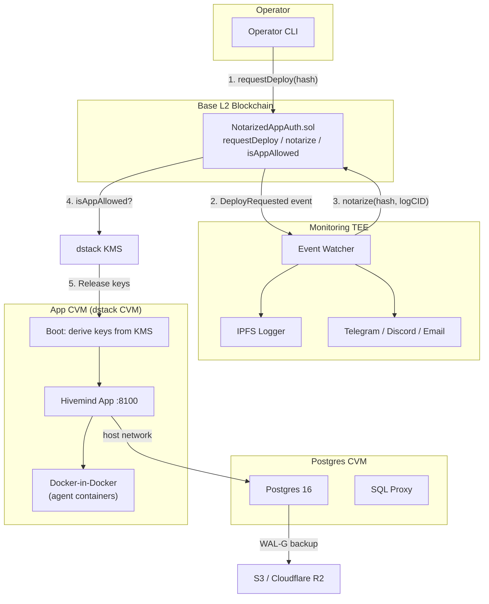
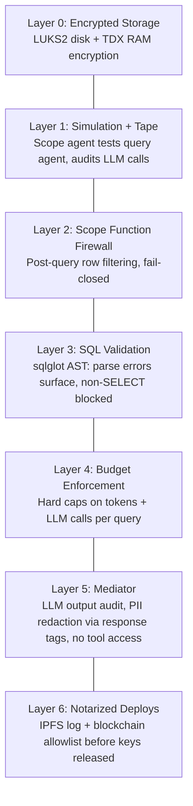
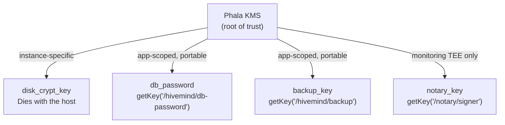

# Hivemind-Core Architecture

Privacy-preserving Postgres inside a TEE. Users write raw SQL. Reads go through
sandboxed agents. Nobody -- including the operator -- sees individual rows.
Only agent-mediated, scope-constrained, mediator-audited answers leave.

Runs inside a dstack Confidential VM. Postgres is plaintext inside the CVM.
Disk encryption (LUKS2) and memory encryption (TDX) are handled by hardware.
No application-level encryption. No record abstraction. Just Postgres.

---

## 1. System Overview



---

## 2. Query Pipeline (Multi-Stage with Async Tracking)

Clients submit agent archives via `/v1/query-agents/submit`. The server
returns a `run_id` immediately. Build + pipeline stages execute in the
background. Clients poll `/v1/query-agents/runs/{run_id}` for progress.

```mermaid
sequenceDiagram
    participant C as Client
    participant API as FastAPI
    participant P as Pipeline
    participant RS as RunStore
    participant S as Scope Agent
    participant Q as Query Agent
    participant M as Mediator Agent
    participant DB as Postgres
    participant LLM as LLM Provider

    C->>API: POST /v1/query-agents/submit (archive)
    API->>RS: create run (status=pending)
    API-->>C: {run_id, agent_id, status: pending}

    rect rgb(50, 50, 60)
        Note over API,P: Stage 0 -- Build (background)
        API->>RS: update_stage(build, started)
        API->>API: Extract archive, build Docker image
        API->>RS: update_stage(build, ended)
    end

    rect rgb(40, 40, 70)
        Note over P,S: Stage 1 -- Scope (optional)
        P->>RS: update_stage(scope, started)
        P->>S: Start container (FULL_READ access)
        S->>LLM: Chat completions (via bridge)
        S->>DB: execute_sql (inspect schema + data)
        S->>P: simulate_query (test proposed scope_fn)
        S-->>P: scope_fn source code
        P->>P: Compile + AST-validate scope_fn
        P->>RS: update_stage(scope, ended)
    end

    rect rgb(40, 70, 40)
        Note over P,Q: Stage 2 -- Query
        P->>RS: update_stage(query, started)
        P->>Q: Start container (SCOPED access)
        Q->>LLM: Chat completions (via bridge)
        Q->>DB: execute_sql(SELECT ...)
        DB-->>P: Raw rows
        P->>P: scope_fn filters results
        P-->>Q: Filtered rows
        Q-->>P: Answer text
        P->>RS: update_stage(query, ended)
    end

    rect rgb(70, 40, 40)
        Note over P,M: Stage 3 -- Mediation (optional)
        P->>RS: update_stage(mediator, started)
        P->>M: Start container (NO data access)
        M->>LLM: Chat completions (via bridge)
        Note over M: Output wrapped in response tags,<br/>reasoning stripped
        M-->>P: Sanitized output
        P->>RS: update_stage(mediator, ended)
    end

    P->>RS: update status=completed, output
    C->>API: GET /v1/query-agents/runs/{run_id}
    API-->>C: {output, stage timings, usage}
```



---

## 3. Sandbox Isolation



---

## 4. Access Levels per Agent Type



---

## 5. Deployment (2-CVM Model)

Previously a 5-CVM architecture (one per agent type + postgres). Now
consolidated to 2 CVMs: Postgres and a single App CVM with Docker-in-Docker
for agent containers.



---

## 6. Security Layers (Defense in Depth)



---

## 7. Key Derivation



---

## 8. Data Visibility Matrix

| Component | Sees Data? | Notes |
|---|---|---|
| Host / Operator | No | LUKS disk + TDX RAM = noise |
| Postgres (in CVM) | All | Plaintext inside CVM, localhost only |
| Python app (in CVM) | All | Orchestrates agents, routes tools |
| Scope Agent | Read-only, all | Full DB read + query agent source |
| Query Agent | Filtered only | Results pass through scope function |
| Index Agent | Read-write | Full DML, blocked from internal tables |
| Mediator | Output text only | No data access, filters agent output via `<response>` tags |
| Client | Mediated output | Cannot access raw data |
| S3 / R2 backup | No | WAL encrypted with libsodium |

---

## 9. Stage Timing (RunStore)

Every pipeline execution is tracked in `_hivemind_query_runs` with per-stage
start/end timestamps and final output:

| Column | Type | Description |
|---|---|---|
| `run_id` | TEXT PK | Unique run identifier |
| `agent_id` | TEXT | Query agent that ran |
| `status` | TEXT | pending / running / completed / failed |
| `build_started_at` / `build_ended_at` | FLOAT | Docker image build |
| `scope_started_at` / `scope_ended_at` | FLOAT | Scope agent resolution |
| `query_started_at` / `query_ended_at` | FLOAT | Query agent execution |
| `mediator_started_at` / `mediator_ended_at` | FLOAT | Mediator processing |
| `output` | TEXT | Final output (truncated to 10k chars) |

Clients poll `GET /v1/query-agents/runs/{run_id}` to see stage progress
and retrieve results.

---

## 10. File Structure

```
hivemind/
  config.py            Settings (Pydantic, env-mapped)
  core.py              Hivemind class: Database + AgentStore + Pipeline
  db.py                Thin Postgres wrapper (psycopg, dict_row)
  models.py            Request/Response models
  pipeline.py          build -> scope -> query -> mediate orchestration
  scope.py             Scope function compilation + AST validation
  server.py            FastAPI HTTP server + embedded UI
  s3.py                S3Uploader (WAL-G backups, s3v4 signatures)
  tools.py             execute_sql + get_schema, AccessLevel enum
  sandbox/
    agents.py          AgentStore (CRUD, file storage)
    backend.py         SandboxBackend (bridge + Docker per agent)
    bridge.py          BridgeServer (LLM proxy, tools, budget, tape)
    budget.py          Budget tracker (calls, tokens)
    docker_runner.py   DockerRunner (container lifecycle, iptables, DinD)
    run_store.py       RunStore (per-stage timing, status tracking)
    tape.py            Tape recorder/replay for simulation

agents/
  base/                Agent SDK base Docker image
  combined/            Simple httpx-based agents (scope/query/index/mediator)
  default-scope/       Default scope agent (Claude Agent SDK)
  default-query/       Default query agent (Claude Agent SDK)
  default-mediator/    Default mediator agent (Claude Agent SDK, response tags)
  default-index/       Default index agent (Claude Agent SDK)

deploy/
  boot.sh              CVM entrypoint (KMS key derivation)
  Dockerfile           Production app image
  docker-compose.yaml  Production dstack deployment (2-CVM: postgres + core)
  docker-compose.dev.yml  Local dev (postgres only)
  contracts/           NotarizedAppAuth.sol (Solidity on Base)
  monitor/             Monitoring TEE (event watcher + notarizer)
  postgres/            Production Postgres image (WAL-G, KMS)
```
