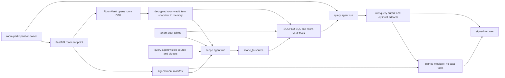
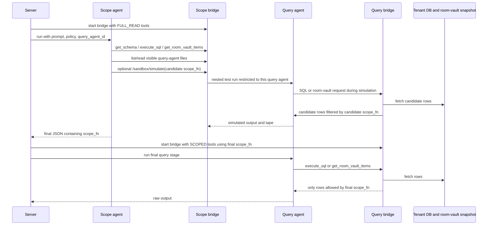

# Architecture

Hivemind-core is a signed-room service for attested recall agreements inside a
confidential VM (CVM). Its main job is to let an owner and participant run an
agreed agent workflow over private inputs without handing either side more
visibility than the signed room policy permits.

The product abstraction is the signed room. The implementation is a FastAPI
control plane, per-tenant Postgres data planes, encrypted room storage, and
Docker-sandboxed agents connected through an in-process bridge.

## Runtime Shape

Production is a two-CVM deployment:

```text
CLI / API client
  -> core CVM: hivemind FastAPI service
       - TenantRegistry resolves hmk_ owner keys and hmq_ room tokens
       - one cached Hivemind instance per tenant
       - RoomStore, RoomVault, AgentStore, RunStore, ArtifactStore
       - Pipeline starts scope/query/mediator agents
       - BridgeServer is the only LLM/tool/artifact endpoint agents see
       - dstack attestation bootstrap exposes compose hash, quote, TLS pin,
         and run-signer public key
  -> postgres CVM: sql_proxy + Postgres
       - control database for tenants, capability tokens, compose pins
       - one tenant database per tenant
       - per-tenant Postgres roles for tenant-shaped databases
```

Local development can point directly at Postgres. In the split Phala deploy,
`hivemind/db.py` uses `HttpDatabase` when `HIVEMIND_DATABASE_URL` is an HTTP
SQL proxy URL. Each SQL call carries the proxy secret and, for tenant data, an
`X-Tenant-DB` header so the Postgres CVM routes to the right tenant database.

Agent containers run inside the core CVM through the host Docker daemon. They
do not receive raw service credentials. The sandbox injects `BRIDGE_URL`,
`SESSION_TOKEN`, and OpenAI/Anthropic-compatible base URLs that point back to
the local `BridgeServer`.

## Important Modules

- `hivemind/server.py`: FastAPI routes, auth dependencies, room endpoint
  orchestration, background task spawning.
- `hivemind/tenants.py`: control-plane tenant registry, owner key lookup,
  room capability token lookup, per-tenant `Hivemind` cache.
- `hivemind/core.py`: wires a tenant's database, stores, room vault, agent
  store, and pipeline together.
- `hivemind/rooms.py`: room manifest schema, canonical JSON signing,
  verification, and room-row persistence.
- `hivemind/room_vault.py`: per-room DEK cache, bearer-wrapped room keys,
  encrypted room items, and room-sealed agent file encryption.
- `hivemind/sandbox/agents.py`: agent metadata and saved source files,
  including tenant-sealed and room-sealed source storage.
- `hivemind/pipeline.py`: scope -> query -> mediator execution and signed
  run attestations.
- `hivemind/tools.py`: SQL and room-vault tools exposed to agents with
  `FULL_READ`, `SCOPED`, `FULL_READWRITE`, or `NONE` access.
- `hivemind/attestation.py`: dstack quote bootstrap, compose hash surface,
  enclave TLS binding, and KMS-derived run signer.

## Databases

The control database is shared by the service and stores only control-plane
state:

- `_tenants`: tenant id, tenant DB name, hashed owner API key.
- `_capability_tokens`: hashed `hmq_` query tokens plus their room constraint
  snapshot.
- `_tenant_compose_pins`: owner-signed compose-hash allowlists.
- `_billing_ledger`: tenant credit grants, run holds, hold releases, and usage
  charges. Positive amounts add credit; negative amounts consume credit.
- `_billing_model_prices`: provider/model pricing snapshots in micro-USD per
  million prompt/completion tokens.

Each tenant database stores that tenant's agents, rooms, runs, artifacts, and
user data:

- `_hivemind_rooms`: signed room envelope plus indexed enforcement fields.
- `_hivemind_room_key_wraps`: one wrapped room DEK per bearer allowed to open
  the room.
- `_hivemind_room_vault_items`: encrypted room document items.
- `_hivemind_agents`: registered agent config and image tags.
- `_hivemind_agent_files`: saved build contexts/source files, plaintext or
  ciphertext depending on inspection and seal mode.
- `_hivemind_query_runs`: async run lifecycle, room binding, visibility, payer
  attribution, metered usage, billing status, and signed run attestation.
- `_hivemind_query_artifacts`: Postgres-backed run artifacts with TTL cleanup.

Agent SQL tools hide `_hivemind_*` tables from room agents. Scope and query
agents see only user tables plus the synthetic `room_vault_items` tool.

## Identity And Tenant Flow

There are two user-facing bearer types:

- `hmk_...`: tenant owner key. It resolves through `_tenants`, thaws or
  initializes the tenant seal, and returns a `Caller(role="owner")`.
- `hmq_...`: query capability token. It resolves through
  `_capability_tokens`, returns a `Caller(role="query")`, and carries a
  snapshot of room constraints. It cannot thaw the tenant seal.

The tenant seal is separate from the room vault. It protects reusable agent
source/build context with a tenant DEK wrapped to the owner key. Room data uses
a room DEK wrapped to the owner and room invite tokens.

Billing identity is separate from room access identity. An `hmq_` room token
authorizes a participant to use a room but is not a tenant billing credential.
For participant-paid runs, the caller sends `X-Hivemind-Payer-Key: hmk_...`.
The server resolves that owner key only to prove payer control; it does not
change room authorization.

## Room Creation Flow

Room creation is `POST /v1/rooms` and is owner-only.

```text
owner hmk_
  -> server resolves tenant and owner Caller
  -> validate scope agent exists
  -> if fixed query room, validate query agent exists
  -> if mediator is configured, validate mediator agent exists
  -> derive owner signing key from hmk_ + tenant_id
  -> build canonical room manifest
  -> sign manifest with Ed25519
  -> store envelope in _hivemind_rooms
  -> mint hmq_ invite token from manifest constraints
  -> create random room DEK
  -> wrap DEK to owner bearer and invite bearer
  -> return hmroom:// link
```

The room manifest is the contract both parties verify. It binds:

- room id, tenant id, name, rules, rules hash, and policy text;
- scope agent id and source visibility;
- query mode: fixed agent or participant-uploaded agent;
- query-agent visibility: inspectable or sealed;
- mediator agent id and source visibility when a mediator is configured;
- output visibility: `querier_only` or `owner_and_querier`;
- allowed LLM providers and artifact egress setting;
- room-level compose trust mode and allowed compose hashes;
- owner public key.

The `hmroom://` link carries the room id, service URL, invite token, and owner
signing public key. The invite token is useful for authentication, but the room
row remains the live source of truth. Endpoints reload `_hivemind_rooms` and
verify the signed envelope on every room operation.

## Room Key And Data Flow

Room data is encrypted by the application before it reaches Postgres.

```text
room DEK: random bytes, cached only in core CVM process memory
owner wrap: derive KEK from owner hmk_ bearer + salt, wrap room DEK
invite wrap: derive KEK from hmq_ bearer + salt, wrap room DEK
room item: encrypt plaintext with room DEK and room/item AAD
```

`RoomVault` stores wraps in `_hivemind_room_key_wraps` and encrypted items in
`_hivemind_room_vault_items`. The AAD includes tenant id, room id, and item id
so ciphertext cannot be moved across tenants, rooms, or items without failing
authentication.

After a process restart or CVM redeploy, the in-memory room DEK cache is empty.
Encrypted room items and room-sealed query-agent files stay unreadable until an
owner or invite holder presents a bearer with a valid wrap:

```text
POST /v1/rooms/{room_id}/open
  -> load wrap row for owner or query token id
  -> derive KEK from presented bearer
  -> unwrap room DEK
  -> cache DEK in RoomVault
```

Owner-only `POST /v1/rooms/{room_id}/data` opens or initializes the room key,
then encrypts and stores a vault item. Owner-only `GET /v1/rooms/{room_id}/data`
decrypts through the owner wrap. Query tokens cannot list room data directly,
but room runs open the same vault through the query token wrap and pass a
plaintext in-memory snapshot into the pipeline.

## Agent Source And Inspection Flow

Agents are Docker images plus saved source/build context.

`POST /v1/room-agents` uploads an archive, builds an image, registers an
`AgentConfig`, and stores source files in `_hivemind_agent_files`.

Source storage depends on inspection mode and room binding:

- `inspection_mode=full`: source is readable through the file-inspection API.
  When the tenant seal is active, the file rows are tenant-encrypted and
  decrypted inside the CVM before serving.
- `inspection_mode=sealed` without `room_id`: source is tenant-encrypted and
  never served through the file-inspection API.
- `inspection_mode=sealed` with `room_id`: source is encrypted under the room
  DEK. This is the normal uploaded query-agent path for sealed uploadable
  rooms.

Sealed source can still be decrypted by internal CVM paths that need to rebuild
images or compute digests. For room-sealed source, those internal paths work
only after the room DEK has been opened by a valid room participant.

Room prompt retention follows the same visibility bit as query-agent source.
When `query.visibility=inspectable`, the run row stores the plaintext prompt so
participants can inspect past questions. When `query.visibility=sealed`, the
run row stores no prompt plaintext; the signed run attestation still commits to
`prompt_hash`.

## Client Inspection And CVM Trust Flow

The intended participant flow is:

```text
hmroom:// link
  -> verify service/CVM trust through /v1/attestation
  -> GET /v1/rooms/{room_id}/attest
  -> verify room envelope against owner_pubkey from link
  -> verify live compose hash against room trust policy
  -> inspect visible scope/fixed-query agent metadata and files
  -> ask or upload a query agent
```

`/v1/rooms/{room_id}/attest` returns:

- the signed room row;
- scope-agent attestation;
- fixed query-agent attestation when the room has one;
- mediator-agent attestation when the room pins one;
- the live CVM attestation bundle.

The live attestation bundle includes the dstack quote, compose hash, app id,
measurements, optional enclave TLS certificate binding, app-auth metadata, and
the KMS-derived run-signer public key. The CLI verifies the room signature and
enforces room trust before submitting a prompt. For non-local services, client
verification is fail-closed by default: DCAP must verify the quote and recover
the compose hash from `mr_config_id`, and REPORT_DATA v2 must bind the
observed TLS certificate to the quote unless the operator explicitly allows a
degraded debug connection.

Room trust modes:

- `operator_updates`: accept the operator-governed deployment path.
- `pinned`: accept only compose hashes embedded in the room manifest.
- `owner_approved`: accept the owner allowlist in the room manifest.

Updating room trust re-signs the same room id. Existing invite links keep
working because they verify the new envelope against the same owner public key.

## Scope And Query Agent Interaction

Inside a room, the scope agent and query agent do not share a database
connection or call each other directly during the final query stage. The server
uses the scope agent to create a runtime policy function, then gives the query
agent only tools that are wrapped by that policy.



The handoff is the `scope_fn`. The scope agent returns JSON with a Python
function source string:

```json
{
  "scope_fn": "def scope_fn(sql, params, rows):\n    ..."
}
```

The pipeline compiles that function and uses it in two places:

- `execute_sql`: the query agent's SQL runs against the tenant database, then
  result rows are passed through `scope_fn` before the agent sees them.
- `get_room_vault_items`: the query agent asks for room-vault items, then the
  in-memory room item rows are passed through the same `scope_fn`.

The scope agent still has the room's "superpowers." They are scope-only
capabilities used to design and test the privacy boundary before the final
query run:

- full read-only SQL over user tables through `execute_sql`;
- full read access to the decrypted in-memory room-vault snapshot through
  `get_room_vault_items`;
- query-agent source inspection through `list_query_agent_files` and
  `read_query_agent_file` when the query agent is inspectable;
- query-agent file path and digest visibility even when sealed source bytes are
  not readable;
- nested simulation through `/sandbox/simulate`, which runs the room's query
  agent against a candidate `scope_fn`;
- batch simulation through `/sandbox/simulate_batch`;
- synthetic scope-function checks through `/sandbox/verify_scope_fn`;
- the same room-bound LLM egress and budget accounting as other agent stages.

Those powers do not transfer to the final query agent. The query agent gets the
prompt and `SCOPE_FN_SOURCE`, but its data tools are `SCOPED`, not `FULL_READ`.
The scope bridge also restricts simulation and source inspection to the room's
bound query agent, so a scope agent cannot use those endpoints to inspect or
run arbitrary tenant agents.

The scope agent gets this richer bridge because its job is to design the
policy:



The optional simulation path is important but bounded. It lets the scope agent
test candidate filters against the specific query agent before committing to a
final `scope_fn`. The bridge enforces that simulation can only invoke the room's
query agent, and the simulated query still receives scoped tools using the
candidate `scope_fn`.

| Actor | Receives | Tools | Produces |
| --- | --- | --- | --- |
| Scope agent | prompt, room policy, query agent id, room-vault snapshot, user DB access | `FULL_READ` SQL, `FULL_READ` room-vault items, visible query-agent file tools, scope simulation and verification endpoints | `scope_fn` source |
| Query agent | prompt and `SCOPE_FN_SOURCE` | `SCOPED` SQL, `SCOPED` room-vault items, LLM bridge if allowed, artifact upload if allowed | raw answer and artifacts |
| Mediator agent | prompt, raw query output, room policy | no SQL or room-vault tools | final mediated output |

So the room's privacy boundary is not "the query agent promises to behave."
It is "the query agent can ask for data only through host tools whose returned
rows are filtered by the scope agent's compiled function."

## Fixed Query Run Flow

The public run endpoint is `POST /v1/rooms/{room_id}/runs`.

```text
client submits query
  -> resolve owner or query Caller
  -> load and verify room envelope
  -> force room scope_agent_id
  -> force fixed query_agent_id, or require an uploaded query_agent_id
  -> force room mediator_agent_id when the manifest pins one
  -> reject caller policy override
  -> validate provider against room egress allowlist
  -> open room vault with caller bearer
  -> decrypt room vault snapshot into memory
  -> resolve payer and reserve a billing hold when a payer is known
  -> create _hivemind_query_runs row
  -> background Pipeline.run_query_agent_tracked
```

The pipeline has three execution stages:

```text
scope stage
  -> scope agent receives FULL_READ SQL tools
  -> scope agent receives FULL_READ room_vault_items tool
  -> scope agent may inspect query-agent files if visible
  -> scope agent returns JSON containing scope_fn source

query stage
  -> query agent receives SCOPED SQL tools
  -> query agent receives SCOPED room_vault_items tool
  -> every SQL result and room-vault result passes through scope_fn
  -> bridge enforces LLM budget, provider allowlist, and artifact setting

mediator stage, pinned when configured
  -> mediator receives raw query output and policy
  -> mediator has no SQL or room-vault tools
```

If the scope agent fails to produce a valid `scope_fn`, the run fails closed.
The query agent is never given scoped tools without a scope function.

LLM egress is also room-bound. If `allowed_llm_providers` is `[]`, the bridge
still starts so non-LLM tools can work, but LLM endpoints return 403. If one or
more providers are allowed, the requested provider must be in the allowlist, or
the server chooses the first allowed provider.

Artifacts are written directly to `_hivemind_query_artifacts` through the
bridge only when `allow_artifacts=true`. There is no external object store in
the normal path.

## Uploadable Query-Agent Run Flow

Uploadable rooms use `POST /v1/rooms/{room_id}/query-agents`.

```text
participant hmq_
  -> load and verify room
  -> confirm room query.mode is uploadable
  -> enforce room policy and provider allowlist
  -> open room DEK with participant bearer
  -> decrypt current room-vault items into memory
  -> read uploaded archive
  -> create run row
  -> background task builds query image
  -> save uploaded source with room inspection mode
  -> run same scope -> query -> mediator pipeline
```

For the default sealed uploadable room, the uploaded query-agent source is
encrypted under the room DEK. The files API returns a sealed error for that
agent, while internal rebuild and digest paths can decrypt inside the CVM after
the room is open.

## Run Records And Output Visibility

Every tracked room run writes a run row as it moves through:

```text
pending -> running -> completed
                  \-> failed
```

On completion or failure, the pipeline builds a signed run attestation when the
CVM run signer is available. The signed body commits to:

- run id and status;
- live compose hash;
- room id and room manifest hash;
- scope and query agent ids;
- full and attested file digests for scope and query agents;
- output visibility, allowed LLM providers, artifact setting;
- room-vault item count;
- prompt hash, output hash, and error hash;
- timestamp and signer public key.

Clients poll `GET /v1/runs/{run_id}`. The CLI verifies the run signature,
matches the signer public key to `/v1/attestation`, matches the compose hash,
room id, room manifest hash, and output hash, then prints the output.

Visibility is enforced when reading run rows:

- query-token callers see only runs they initiated;
- owners see tenant run metadata;
- for participant-initiated runs with `output.visibility=querier_only`, owners
  get output, error, index output, and artifacts redacted.

## Billing Flow

Billing is tenant-scoped and lives in the control database because the payer
may be different from the data-owner tenant whose room is being queried.

```text
room ask with hmq_ invite + optional X-Hivemind-Payer-Key
  -> room authorization uses hmq_
  -> payer authorization uses hmk_
  -> create _billing_ledger usage_hold for requested token budget
  -> run scope, query, mediator, and optional index stages
  -> collect per-stage calls, prompt tokens, completion tokens, provider, model
  -> write usage_json and payer fields to _hivemind_query_runs
  -> release hold and write exact usage_charge ledger entry
```

Run rows carry `payer_tenant_id`, `payer_token_id`, `billable_role`,
`usage_json`, `billing_provider`, `billing_model`, hold amount, actual cost,
and settlement status. The ledger is append-only. Current entry kinds are
`credit_grant`, `usage_hold`, `usage_release`, and `usage_charge`.

Credit enforcement is deployment-configurable with
`HIVEMIND_BILLING_ENFORCE_CREDITS`. When false, the service meters and charges
known payers but does not reject missing or negative balances. When true,
query-token runs require a payer credential and enough available credit for the
preflight hold.

## Egress Boundaries

Room egress has only three intended exits:

- final run output, subject to room output visibility;
- LLM calls, subject to the room provider allowlist;
- artifacts, subject to `allow_artifacts=true` and TTL cleanup.

Agent containers should not talk directly to the internet in production. They
talk to the local bridge. The bridge owns upstream LLM clients, tool handlers,
artifact upload, replay tape recording, and budget accounting.

## Redeploy And Restart Behavior

The CVM operator can deploy new backends, but clients can observe changes
through the attestation bundle and room trust policy.

Important restart properties:

- tenant and room DEK caches are process-memory only;
- tenant-encrypted source cannot be decrypted by query tokens on a cold tenant
  seal until the owner interacts;
- room data and room-sealed query source cannot be decrypted until an owner or
  invite holder opens the room;
- Docker image cache may be wiped on a CVM update, so stored source/build
  contexts let the core rebuild agent images from tenant Postgres;
- a malicious future deployment still needs a room participant to present a
  valid room bearer before old room data or room-sealed source becomes
  readable in that process.

That last point is why the client-side inspection flow matters: a participant
should verify the live CVM attestation and room trust policy before presenting
the invite token to a new deployment.

## Public Surface

The room-first API surface is:

```text
POST /v1/rooms
GET  /v1/rooms
GET  /v1/rooms/{room_id}
GET  /v1/rooms/{room_id}/attest
GET  /v1/rooms/{room_id}/key
POST /v1/rooms/{room_id}/open
POST /v1/rooms/{room_id}/data
GET  /v1/rooms/{room_id}/data
POST /v1/rooms/{room_id}/trust
POST /v1/rooms/{room_id}/runs
POST /v1/rooms/{room_id}/query-agents

POST /v1/room-agents
GET  /v1/room-agents
GET  /v1/room-agents/{agent_id}
GET  /v1/room-agents/{agent_id}/files
GET  /v1/room-agents/{agent_id}/files/{path}
GET  /v1/room-agents/{agent_id}/attest

GET  /v1/runs
GET  /v1/runs/{run_id}
GET  /v1/runs/{run_id}/artifacts/{filename}

GET  /v1/attestation
GET  /v1/whoami

GET  /v1/admin/billing/{tenant_id}
POST /v1/admin/billing/{tenant_id}/credits
GET  /v1/admin/billing/prices
POST /v1/admin/billing/prices
```

Lower-level `_internal` routes exist for compatibility, tests, and maintenance.
New clients should use the room endpoints.
